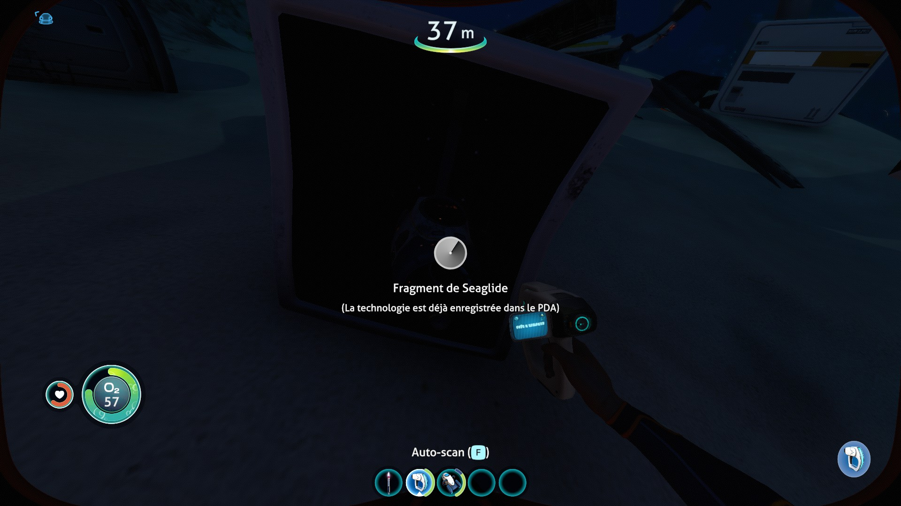
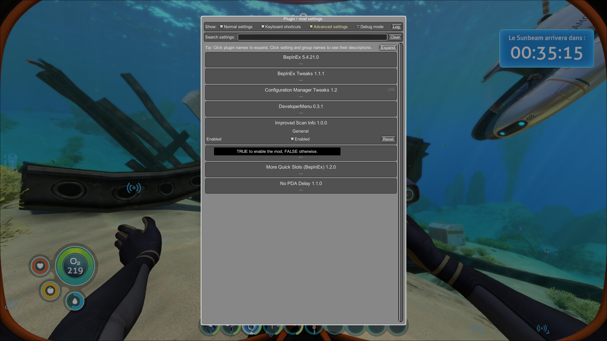

# Improved Scan Info

## Description

This mod show information to allow user know if he already synthetized blueprint when he look at a fragment.

BepInEx configuration menu (to enable/disable show information about improved scan info) :

## For developers

### Needed references

- System
- System.Core
- Assembly-CSharp
- UnityEngine (Can be founded in subnautica game folder)
- UnityEngine.CoreModule (Can be founded in subnautica game folder)
- 0Harmony (Need Harmony plugin)
- BepInEx (Need BepInEx plugin)

### Github Project

The source code can be found here : https://github.com/KnifeOnlyI/SubnauticaMods/tree/master/ImprovedScanInfo_BZ