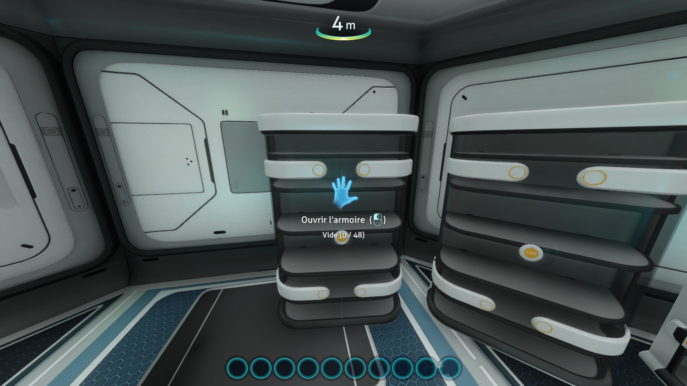
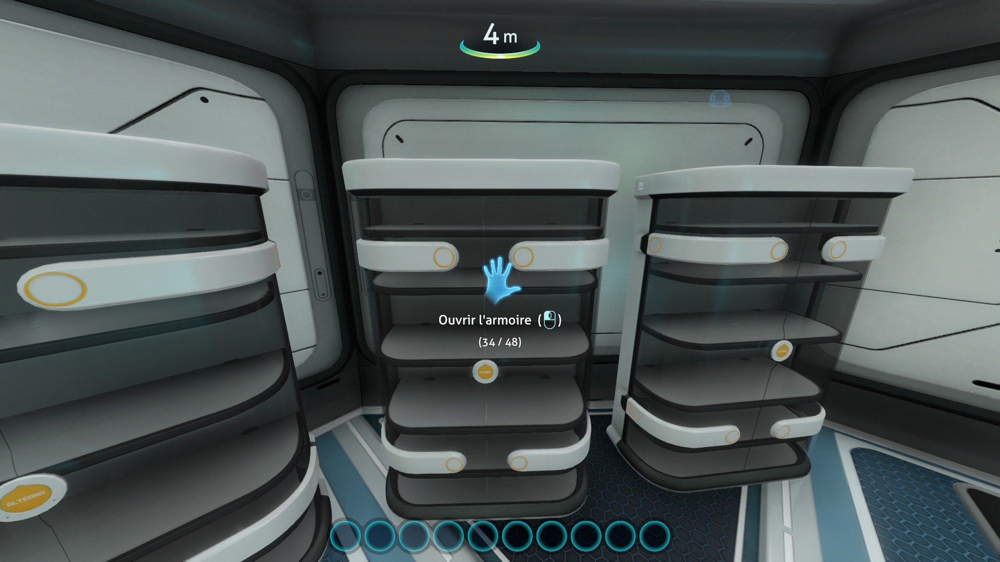
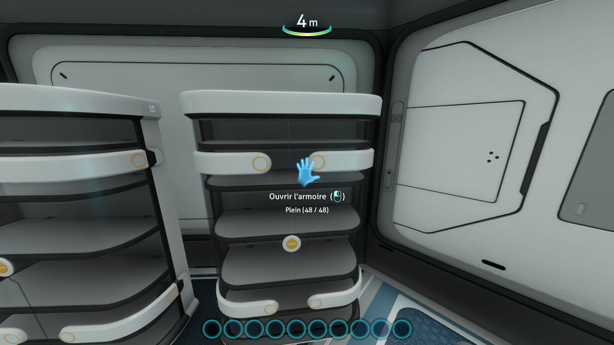
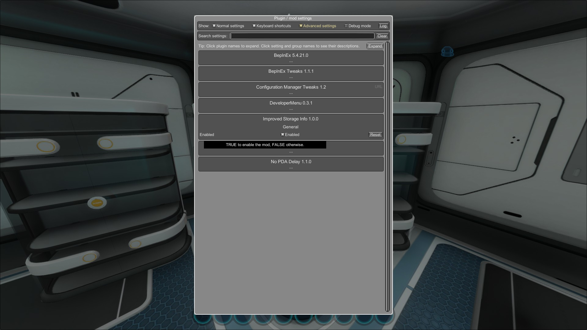

# Improved Storage Info

This mod is inspired by another
mod : [https://www.nexusmods.com/subnautica/mods/229](https://www.nexusmods.com/subnautica/mods/229)

## Description

This mod allow to show some information when the player hand over on a storage.

Information about an empty container :

Information about a not empty container :

Information about a full container :

BepInEx configuration menu (to enable/disable show information about improved storage info)

## For developers

### Needed references

- System
- System.Core
- Assembly-CSharp
- UnityEngine (Can be founded in subnautica game folder)
- UnityEngine.CoreModule (Can be founded in subnautica game folder)
- 0Harmony (Need Harmony plugin)
- BepInEx (Need BepInEx plugin)
- LitJSON (Can be founded in subnautica game folder)

### Github Project

The source code can be found here : https://github.com/KnifeOnlyI/SubnauticaMods/tree/master/ImprovedStorageInfo